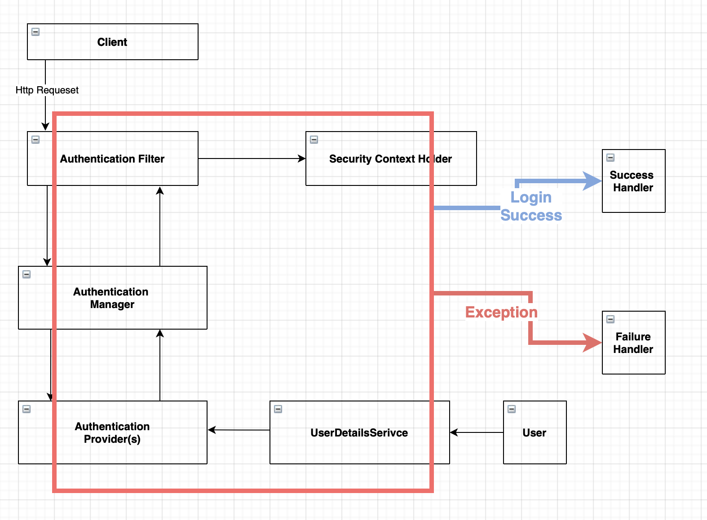
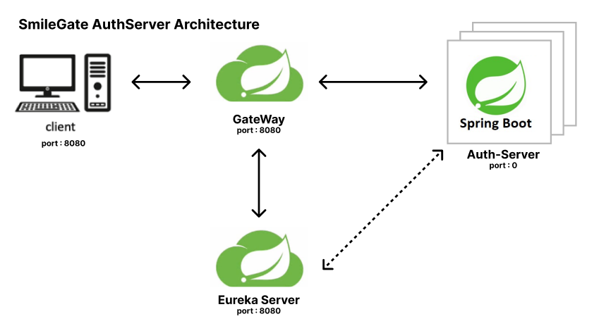

# README

# 🖥️프로젝트 소개

---

SmileGate SpringBoot MSA 인증서버 과제입니다.

로그인, 로그아웃, 회원가입, 유저 관리, 관리자 권한 관리 기능이 있습니다.

## ⏱️개발기간

---

2022.12.19 ~ 2022.12.25

## 🔨How to Run

---

```bash
cd deploy
./script.sh
```

## 개발 환경

- docker-compose
- docker
- SpringBoot 3.0.0
- Java 17
- netflix-eureka-server
- netflix-eureka-client
- spring-security
- jwt
- jsp

# 아키텍처

전체 아키텍처


### 내부 아키텍처

인증 서버 내부는 헥사고날 아키텍처로 의존성 분리를 초점으로 구현



- Eureka 서버에 등록시켜서 실제 통신은 GateWay 통해서 라우팅된다,

# 기능 명세

# Domain 구축

## User parameters

- BaseTimeEntity
- id
- name
- password
- email
- role
- isAccountNonExpired : 계정이 만료되지 않았는지
- isAccountNonLocked : 계정이 잠겨있지 않은지
- isCredintialNonExpired : 계정의 패스워드가 만료되지 않았는지
- isEnabled : 계정이 사용가능한 계정인지
- `Collection<? extends GrantedAuthority> authorities`
- DisabledException : 계정비활성화

# 기능 구현

### Account

- 회원가입
- 회원 가입시 암호화
- 이메일중복확인
- 로그인
- Token 유효 확인 ( checkValidToken )
- 로그아웃
- reIssue
- 비밀번호 Input 대문자, 소문자, 특수문자 확인
- 회원가입 후 이메일 인증 시 isCredentialNonExpired, isEnabled  true 로 변경
- 자동 로그인 ( 로그인 상태 유지 )
- 로그인 실패경우 다른 반환
    - 아이디 비밀번호가 일치하지 않을 경우
    - 접근 권한이 없는 계정일 경우
    - 현재 사용할 수 없는 경우일 경우
    - FrailureHandler 연동



### User

- 유저 전체 조회
- 유저 한명 단순 조회
- 이름으로 유저 검색
- 회원 삭제 - 회원 expired → true로 변경
- 유저 회원정보 수정